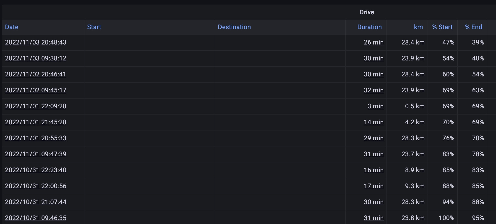
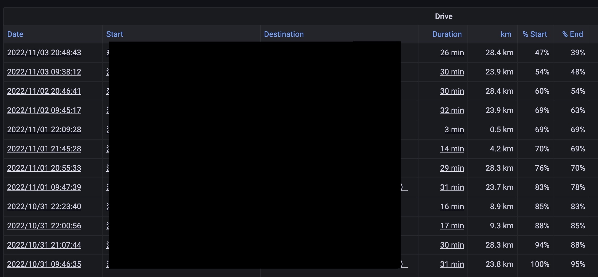

# teslamate-addr-fix

[English](README.md)

本项目解决因 openstreetmap 被封禁而导致 teslamate 地址丢失的问题

## 注意

**在使用之前必须进行 [备份](https://docs.teslamate.org/docs/maintenance/backup_restore).**


## 前提条件
- 您也遇到了 teslamate [地址丢失的问题](https://github.com/adriankumpf/teslamate/issues/2956)

- 您有 **HTTP 代理** 可访问 openstreetmap.org

## 演示

修复前: (没有 start/destination 信息, 因 openstreetmap 被封禁)


修复后:


## 安装教程 (任选其一)

### 1. Docker Compose 安装 (推荐)

- 确保您的 HTTP 代理已设置成 **"允许来自局域网的连接"**, 然后找到 **局域网 IP:端口**. 例如, 一个代理的局域网 IP 为 `192.168.x.x`. 通常情况下, 局域网 IP **不会是** 本机地址 `127.x.x.x` 或者 docker 内部地址 `172.x.x.x`

- 修改 teslamate 的 docker compose 文件:

	```
	# 在 'database' 部分之后插入下列代码

	teslamate-addr-fix:
      image: waynejz/teslamate-addr-fix
      restart: always
      platform: linux/amd64
      environment:
	    - PROXY=http://192.168.0.100:7890    # 设置你的 HTTP 代理
        - DATABASE_USER=teslamate
        - DATABASE_PASS=123456               # 从 'teslamate' 对应部分复制
        - DATABASE_NAME=teslamate
        - DATABASE_HOST=database
      depends_on:
        - database
	```

	如果你改变了 teslamate 的其他默认值 (例如 DATABASE_HOST), 那你也应该从 'teslamate' 对应部分复制并替换它们.

-  然后执行 `docker-compose up -d` 重建 docker. 本工具会在同一个子网下和 teslamate 一起运行. 几分钟后, 你可以查看 teslamate grafana 的 drive graph 检查是否修复. 


### 2. 二进制程序安装

- 从 [releases page](https://github.com/WayneJz/teslamate-addr-fix/releases) 下载本工具. 确保你下载的工具和你的系统架构/版本一致.

- 将 teslamate postgres 数据库端口暴露给主机. 如果你是用 docker compose 安装的, 直接在 .yml 文件中填充端口即可, 然后执行 `docker-compose up -d` 重建 docker.

	```
	database:
		image: postgres:14
		restart: always
		environment:
		- POSTGRES_USER=teslamate
		- POSTGRES_PASSWORD=xxxxxxxx
		- POSTGRES_DB=teslamate

		# 加入这两行
		ports:
		- 5432:5432 
	```

- 配置并启动 HTTP 代理. 您可以提前配置系统代理, 或者在运行时再指定代理. 系统代理的设置类似这样:

	```
	# Your .bashrc/.zshrc

	export all_proxy=socks5://127.0.0.1:7890
	export http_proxy=http://127.0.0.1:7890
	export https_proxy=http://127.0.0.1:7890
	```

- 执行帮助指令 `./teslamate-addr-fix -h`. 您至少需要指定 teslamate 的 postgres 数据库密码, 否则程序无法连接到 teslamate 的数据库. 其他参数如果和默认值不同的话也需要指定.

	```
	Usage of ./teslamate-addr-fix:
	-db string
			teslamate psql database (default "teslamate")
	-host string
			teslamate psql host (default "127.0.0.1")
	-interval int
			interval (minutes) for running in daemon mode
	-password string
			teslamate psql password
	-port string
			teslamate psql port (default "5432")
	-proxy string
			http proxy (default use system proxy)
	-timeout int
			timeout of openstreetmap request (default 5)
	-user string
			teslamate psql user (default "teslamate")
	```

- 根据指示填充参数然后开始修复. 指定参数执行程序, 比如 `./teslamate-addr-fix -password 123456`, 然后日志将会输出在 `teslamate-addr-fix.log`

- 当程序执行完成后, 查看 teslamate grafana 的 drive graph 检查是否修复.


### 3. 原生 Docker 安装 (不推荐)

当然你可以使用原生 docker 分开运行本工具, 但因为不是在 docker compose 中安装, 本工具未和 teslamate 加入同一子网, 该方法可能比较困难且不推荐.

- 为了原生 docker 运行本工具, 准备工作包括 **"允许来自局域网的连接"** 和 **"将 teslamate postgres 数据库端口暴露给主机"**, 详情参考上述内容.

- 拉取镜像并使用后台模式运行:

	```
	docker pull waynejz/teslamate-addr-fix:latest

	docker run --name 'teslamate-addr-fix' --platform 'linux/amd64' \
	-e PROXY='http://192.168.0.100:7890' \ 
	-e DATABASE_USER='teslamate' \
	-e DATABASE_PASS='123456' \
	-e DATABASE_NAME='teslamate' \
	-e DATABASE_HOST='192.168.0.100' \
	-e DATABASE_PORT='5432' \
	-d waynejz/teslamate-addr-fix
	```

	注意: `PROXY` 和 `DATABASE_HOST` 都应该是局域网 IP. 如果遇到了语法错误, 将上述多行合并为一行命令并去掉斜杠后重试.

- 如果运行成功, 等待几分钟后查看 teslamate grafana 的 drive graph 检查是否修复.

## FAQ

- Q: 我的 docker 运行有问题, 有一些额外参数可以调整吗?

	A: 如有必要, 下列额外参数可以调整 (如果运行正常不要设置):

	```
	- OSM_TIMEOUT=5          # openstreetmap 请求超时时间 (默认 5 秒)
	- DATABASE_PORT=5432     # teslamate postgres 端口 (默认 5432)
	- INTERVAL=5             # 后台模式的检查间隔 (默认 5 分钟)
	```

	调整后, 必须重启以生效.

- Q: 该程序没有日志输出, 运行正常吗?

	A: 如果没有丢失地址的数据, 该程序不会有任何日志输出. 你可以检查你的 drive graph.

- Q: 地址都成功被修复了, 为什么我还是看不到 drive map?

	A: Grafana drive map 是一个前端特性, 所以应确保你的工作电脑 (而不是 NAS 服务器) 能访问 openstreetmap, 如有必要应当通过网络代理.

## 免责声明

仅当完整创建了备份后才能使用本程序, 本人**不对因使用本程序造成的任何数据丢失或程序错误负责**.

本项目仅供学习交流使用, **不提供任何网络代理及其下载链接**. 如违反当地法律法规使用网络代理的, 造成的后果由使用者负责.

当您下载, 复制, 编译或运行本项目的源代码或二进制程序时, 即代表您同意上述免责声明.